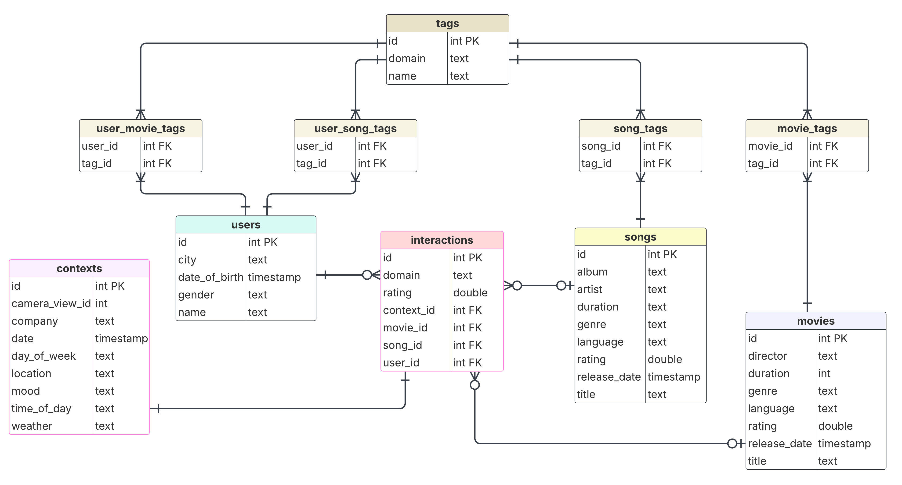

# A Dataset for Evaluating Multi-Domain and Context-Aware Recommendation Algorithms

  
*Relational Database Schema*

## Overview
This dataset captures user interactions with movies and songs, including ratings, contextual metadata, and tagging information. The data structure follows a **relational model**, consisting of multiple interconnected tables to support recommendations, user preferences, and behavioral analysis.  

Contributions to the dataset can be made using the [Contextual Recommenders Data Acquisition System](https://recommendation-data-collection.pl/).

## Contact

For any questions, feedback, or collaboration inquiries related to this dataset, please feel free to reach out:

- **Project Maintainer**: [Michał Rejmak, Marta Frąckowiak, Aleksandra Karpus]  
- **Email**: [michal70005@gmail.com, martowiak@gmail.com, aleksandra.karpus@pg.edu.pl]   
- **Website**: [Contextual Recommenders Data Acquisition System](https://recommendation-data-collection.pl/)  

If you require access to camera view recordings, please request the access to [Google Drive](https://drive.google.com/drive/folders/1l6ljwbePTE7AGXeR8AK91yNyHtQNBBO9?usp=sharing) and submit [The Consent for Scientific Use of Camera Recordings](https://docs.google.com/forms/d/e/1FAIpQLSdNNvwiscSzf4P9EraEAkUW8r8ZPtFu6egMOws0crNmSmkr_Q/viewform?usp=dialog) via Goolge Forms.

## Dataset Maintenance
As the volume of gathered data continues to grow significantly, the repository will be **regularly updated and enriched** with new records.

## Dataset Exploratory Data Analysis
The `dataset-analysis.ipynb` file contains the results of the analysis conducted on the gathered dataset. It can be reused whenever the dataset is updated.

## Database Schema
The dataset includes the following tables:

### 1. **interactions**
Stores user interactions with movies or songs.
- `id` (INT, PK): Unique identifier for an interaction.
- `domain` (TEXT): Indicates whether the interaction is with a 'movie' or 'song'.
- `rating` (DOUBLE): User rating (0-5 scale).
- `context_id` (INT, FK): Reference to the `contexts` table.
- `movie_id` (INT, FK): Reference to the `movies` table, NULL if it's a song interaction.
- `song_id` (INT, FK): Reference to the `songs` table, NULL if it's a movie interaction.
- `user_id` (INT, FK): Reference to the `users` table.

### 2. **contexts**
Captures contextual metadata during user interactions.
- `id` (INT, PK): Unique context identifier.
- `camera_view_id` (INT): Camera recording ID (-1 if not consented). The video file with the corresponding filename is stored on the [Google Drive](https://drive.google.com/drive/folders/1l6ljwbePTE7AGXeR8AK91yNyHtQNBBO9?usp=sharing) (Access restricted).
- `company` (TEXT): Who the user is with during interaction (alone, partner, friends, etc.).
- `date` (TIMESTAMP): Date of the interaction.
- `day_of_week` (TEXT): Day of the week.
- `location` (TEXT): User's location (home, work, etc.).
- `mood` (TEXT): User's emotional state.
- `time_of_day` (TEXT): Time segment (morning, afternoon, etc.).
- `weather` (TEXT): Weather condition during interaction.

### 3. **movies**
Contains movie details.
- `id` (INT, PK): Unique movie identifier.
- `director` (TEXT): Movie director.
- `duration` (INT): Length of the movie in minutes.
- `genre` (TEXT): Primary genre.
- `language` (TEXT): Movie language.
- `rating` (DOUBLE): IMDB rating (0-10 scale).
- `release_date` (TIMESTAMP): Release date.
- `title` (TEXT): Movie title.

### 4. **songs**
Contains song details.
- `id` (INT, PK): Unique song identifier.
- `album` (TEXT): Album name.
- `artist` (TEXT): Artist name.
- `duration` (TEXT): Duration formatted as MM:SS.
- `genre` (TEXT): Primary genre.
- `language` (TEXT): Song language.
- `rating` (DOUBLE): Rating from rateyourmusic.com (0-5 scale).
- `release_date` (TIMESTAMP): Release date.
- `title` (TEXT): Song title.

### 5. **users**
Stores user profile information.
- `id` (INT, PK): Unique user identifier.
- `city` (TEXT, optional): User's city of residence.
- `date_of_birth` (TIMESTAMP, optional): User's birthdate.
- `gender` (TEXT): Gender (male, female, or other).

### 6. **tags**
Contains tagging information for movies and songs (genres).
- `id` (INT, PK): Unique tag identifier.
- `domain` (TEXT): Either 'movie' or 'song'.
- `name` (TEXT): Tag name.

### 7. **movie_tags**
Associates movies with tags.
- `movie_id` (INT, FK): Reference to `movies`.
- `tag_id` (INT, FK): Reference to `tags`.

### 8. **song_tags**
Associates songs with tags.
- `song_id` (INT, FK): Reference to `songs`.
- `tag_id` (INT, FK): Reference to `tags`.

### 9. **user_movie_tags**
Links users to movie tags.
- `user_id` (INT, FK): Reference to `users`.
- `tag_id` (INT, FK): Reference to `tags`.

### 10. **user_song_tags**
Links users to song tags.
- `user_id` (INT, FK): Reference to `users`.
- `tag_id` (INT, FK): Reference to `tags`.

## Usage & Applications
- **Personalized Recommendations**: Based on user ratings and contextual factors.
- **Behavioral Analysis**: Understand trends in media consumption.
- **Sentiment & Mood Analysis**: Investigate how mood affects content preferences.
- **Tag-Based Filtering**: Enable recommendations based on user-defined tags.

## Citation
If you use this dataset, please cite the repository:
```
@misc{movie_song_interaction_dataset,
  author = {Michał Rejmak, Marta Frąckowiak},
  title = {A Dataset for Evaluating Context-Aware Recommendation Algorithms in the domain of Songs and Movies},
  year = {2025},
  howpublished = {\url{https://github.com/Recommendation-Data-Acquisition-Project/A-Dataset-for-Evaluating-Multi-Domain-and-Context-Aware-Recommendation-Algorithms}}
}
```
